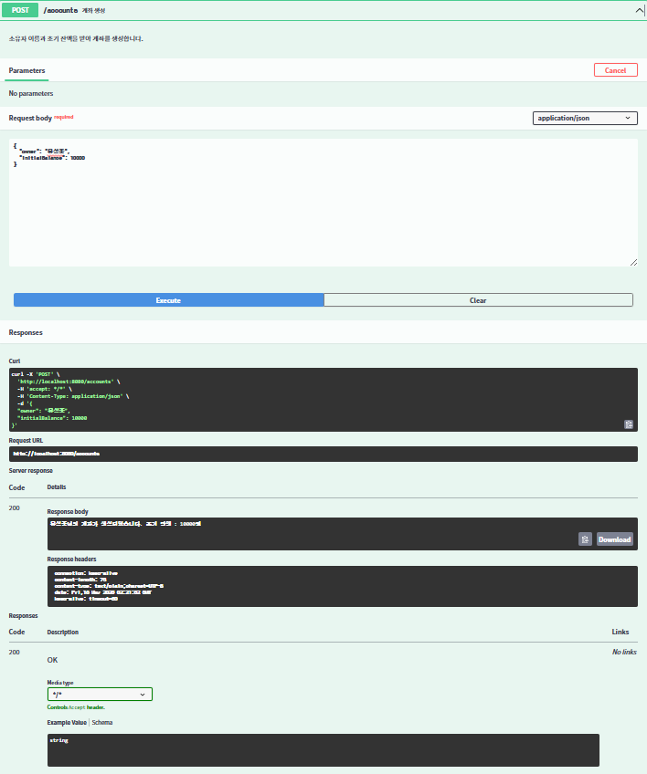
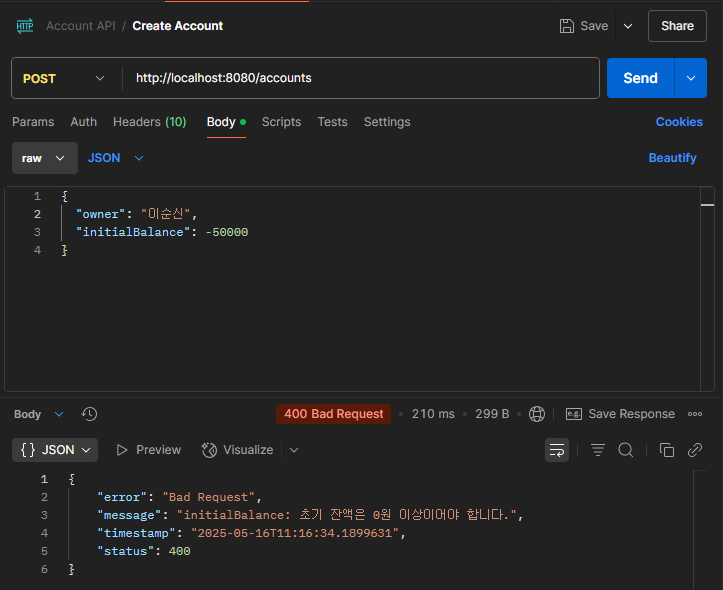
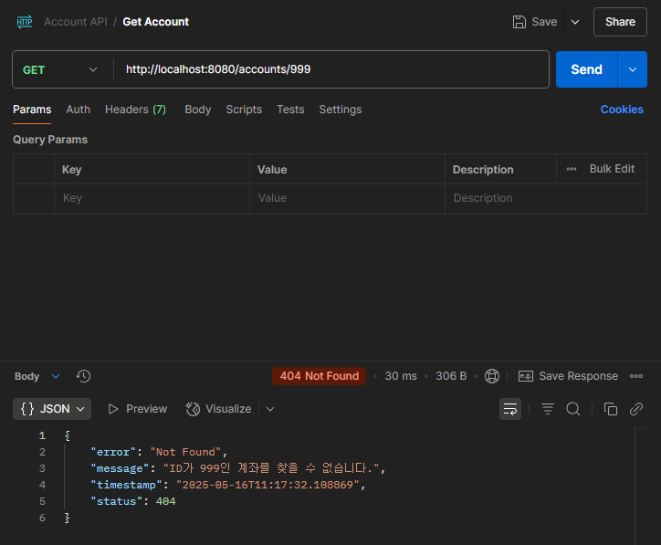
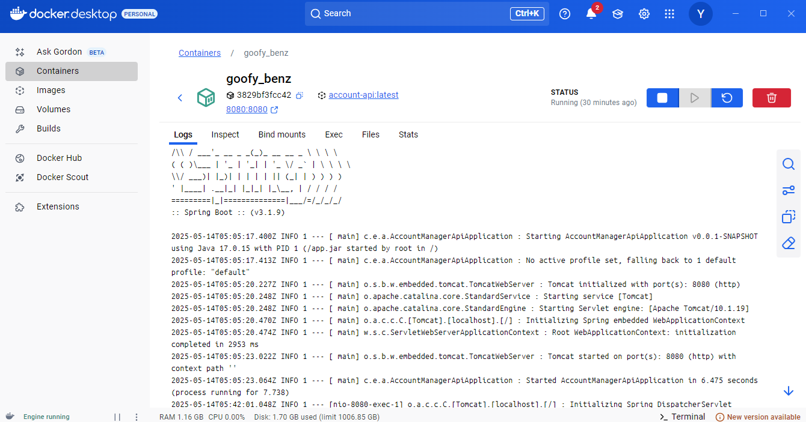

# 💻 계좌 관리 REST API

기존 콘솔 기반 자바 프로젝트를 Spring Boot 기반 REST API로 리팩토링한 학습용 백엔드 프로젝트입니다.  
계좌 생성, 입금, 출금, 잔액 조회 등 은행 계좌 시스템의 핵심 로직을 HTTP 기반 RESTful API로 구현했습니다.

---

## 🎯 학습 목표

- Spring Boot 기반 REST API 설계 및 계층 분리 (Controller / Service / Model / DTO)
- 객체지향적인 코드 구성 및 예외 처리 방식 학습
- Request/Response 구조 명확화 및 유효성 검증 적용 (`@Valid`, `@NotBlank`, `@Min`)
- Swagger를 활용한 API 문서 자동화
- Postman을 활용한 API 테스트 경험
- Docker를 활용한 백엔드 실행 환경 구성

---

## 🛠 기술 스택

- Java 17  
- Spring Boot 3.1.9  
- Gradle  
- JUnit 5  
- Swagger (springdoc-openapi 2.0.4)  
- Postman (API 테스트 도구)  
- Docker

---

## 🌐 Swagger 문서

- Swagger UI: [http://localhost:8080/swagger-ui/index.html](http://localhost:8080/swagger-ui/index.html)  
- Swagger 문서는 `springboot-3.1` 브랜치 기준으로 확인 가능합니다.

> ⚠️ 참고: springdoc-openapi는 Spring Boot 3.2.x와 완벽히 호환되지 않아  
> Swagger UI는 `springboot-3.1` 브랜치(Spring Boot 3.1.9 기준)에서 정상 작동합니다.



---

## 📂 프로젝트 구조

```text
src
└─ main
   ├─ java
   │  └─ com.example.account_manager_api
   │     ├─ controller
   │     ├─ dto
   │     ├─ model
   │     ├─ service
   │     └─ exception
   └─ resources
```

---

## 🧪 브랜치 정리

- `main`: Spring Boot 3.2 + Java 17  
- `springboot-2.7-java11`: Spring Boot 2.7 + Java 17 + javax.validation

---

## 📌 주요 기능 (Endpoints)

| 메서드 | 경로              | 설명           |
|--------|-------------------|----------------|
| POST   | `/accounts`       | 계좌 생성      |
| GET    | `/accounts`       | 모든 계좌 조회 |
| GET    | `/accounts/{id}`  | 단일 계좌 조회 |
| PUT    | `/accounts/{id}`  | 계좌 정보 수정 |
| DELETE | `/accounts/{id}`  | 계좌 삭제      |

> ❗추가로, 잘못된 요청에 대한 예외 응답 처리 및 유효성 검증 로직도 포함돼 있습니다.

---

## 🔍 API 테스트 예시

### ✅ 계좌 생성 API (POST /accounts)

요청 예시:

```json
{
  "owner": "홍길동",
  "initialBalance": 50000
}
```

응답 예시:

```
홍길동님의 계좌가 생성되었습니다. 초기 잔액 : 50000원
```


---

### ❌ 유효성 검증 실패 예시 (owner 비어있음)

요청 예시:

```json
{
  "owner": "",
  "initialBalance": 10000
}
```

응답 예시:

```json
{
  "code": 400,
  "message": "잘못된 요청입니다.",
  "errors": [
    {
      "field": "owner",
      "message": "예금주명은 필수입니다."
    }
  ]
}
```



---

### ✅ 단일 계좌 조회 (GET /accounts/{id})

```http
GET /accounts/1
```

응답 예시:

```json
{
  "id": 1,
  "owner": "홍길동",
  "balance": 50000
}
```


---

### ❌ 존재하지 않는 계좌 조회

```json
{
  "code": 404,
  "message": "해당 계좌를 찾을 수 없습니다."
}
```



---

## 🐳 Docker 실행

```bash
docker build -t account-api .
docker run -p 8080:8080 account-api
```



---

## 📝 향후 개선 예정

- JPA + DB 연동으로 영속성 부여  
- 계좌 이체 기능 추가  
- Spring Security 기반 인증 기능 적용  
- Git 브랜치를 활용한 Java 11 호환 실습 추가 예정

---

## 🙋‍♂️ 만든 사람

- 유성준 (dev-sungjun23)  
- GitHub: [https://github.com/dev-sungjun23](https://github.com/dev-sungjun23)